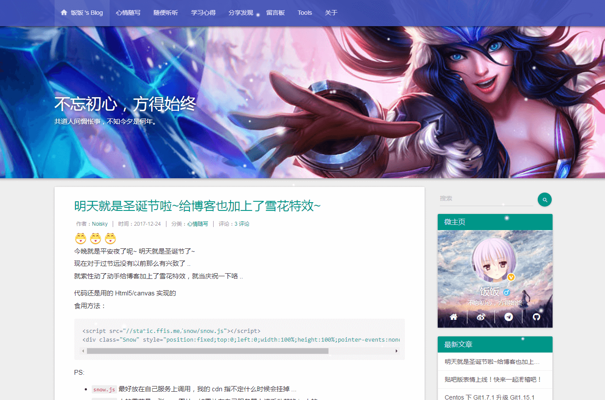

# typecho-material-theme
这是 Noisky 修改的基于 Material 的 Typecho 模板

仅供本人测试使用

效果展示：https://ffis.me

如需使用请手动把所有的cdn资源替换为本地资源...

并且移除comments.php中的表情插件的输出语句`<?php Smilies_Plugin::output(); ?>`

表情插件还没整理...

## feature

_增加个人微主页_

_增加父级分类_

_增加一言显示_

_自定义图片与标语_

_分类导航栏显示_

_备案号自定义_

_定义是否显示加载时间_

## other

如需使用友情链接，请使用以下链接的插件

https://github.com/noisky/Links-for-Rozv-Theme
