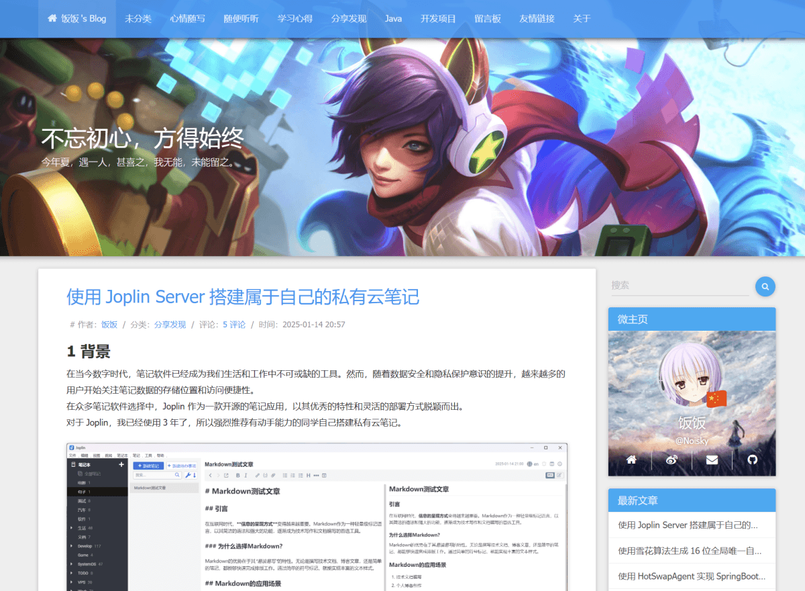

# typecho-material-theme

这是 Noisky 修改的基于 Material 的 Typecho 模板

为方便进行更新才整理到github，仅供本人测试使用

效果展示：https://ffis.me

如需使用请手动把 **所有** 的cdn资源替换为本地资源...

## feature

_全站图片懒加载_

_增加多种主题配色_

_增加友情链接_

_增加个人微主页_

_增加父级分类_

_增加一言显示_

_自定义图片与标语_

_分类导航栏显示_

_备案号自定义_

_定义是否显示加载时间_

## 支持插件

### 友情链接
https://github.com/noisky/Links_for_Material_Theme

### 表情插件
https://github.com/noisky/typecho-smilies
